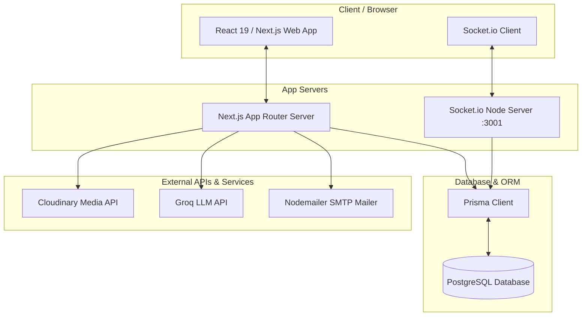

# 🌴 MyBuko — Turn Bucket List Dreams into Reality

**MyBuko** is a premium, full-stack, AI-powered social goal tracking and financial planner application. It is designed to help users transition their bucket lists from wishful thinking into real, lived-out experiences. 

Users can structure their aspirations into bite-sized milestones, manage budgets in Indian Rupees (₹), track savings streaks, share progress with a supportive community, and receive contextual optimization advice from an AI Financial Coach.

---

## 🏗️ Architectural Overview

MyBuko features a decoupled real-time system and API layers:



---

## ✨ Features

### 🎯 1. Goal & Milestone Tracking
- **Interactive Roadmap**: Break down bucket list goals into chronological, ordered milestones.
- **Goal Attributes**: Set targeted deadlines, difficulty ratings (Easy/Medium/Hard), priorities, cover images, estimated costs, and tags.
- **Privacy Controls**: Share goals with the community by setting visibility to **Public**, or keep them **Private** for your eyes only.
- **Dynamic Notes**: Jot down reflections, research findings, and itineraries directly within each goal.

### 💸 2. Financial Ledger & Budgeting
- **Income & Expense Tracker**: Log financial transactions categorized under tags like *Food, Travel, Education, Shopping, Entertainment, Health, Bills, or Savings*.
- **Emergency Fund Goals**: Keep tabs on emergency savings targets and progress separate from active goal funding.
- **Savings Streaks**: Gamify financial consistency with automated savings streak metrics.
- **Category Budgets**: Define and monitor spending thresholds to optimize saving rates.

### 🤖 3. AI-Powered Assistant (Powered by Groq)
- **AI Milestone Planner**: Auto-generate custom milestone roadmaps for any goal.
- **AI Goal Refiner**: Improve goal descriptions and titles to make them more actionable.
- **AI Financial Coach**: Get alternative, budget-friendly ways to achieve your goals and receive realistic cost estimates calculated in Indian Rupees (₹).
- **AI Progress Tips**: Receive personalized context-aware financial advice based on your current savings and transaction habits.

### 👥 4. Social Network & Community Hub
- **Community Feed**: Discover public goals and progress updates from other dream-builders.
- **Posts & Engagement**: Share progress updates with inline photos, view counts, comments, and likes.
- **Ephemeral Stories**: Share short-lived visual updates (expires in 24 hours) with real-time feedback.
- **Follow Network**: Follow peers, build a timeline of goal-achieving friends, and get notified when they interact with your content.

### 💬 5. Real-Time Chat System
- **Instant Messaging**: Chat with connections in real-time via persistent rooms.
- **Rich Media**: Send files and images in chat rooms, backed by Cloudinary storage.
- **Social Context**: Typing indicators, read receipts, and interactive emoji reaction triggers.

---

## 🛠️ Tech Stack

| Component | Technology | Description |
| :--- | :--- | :--- |
| **Frontend** | React 19, Next.js (App Router), TypeScript | High-performance, SEO-friendly framework. |
| **Styling** | Tailwind CSS v4, Framer Motion, Lucide | Modern design system with smooth micro-animations. |
| **Backend** | Next.js API Routes, Node.js | Fast, serverless-ready REST endpoint delivery. |
| **WebSockets** | Socket.io (Node server) | Real-time chat, typing status, and read receipt streams. |
| **Database** | PostgreSQL | Robust relation storing for profiles, posts, goals, and history. |
| **ORM** | Prisma ORM | Type-safe schema definitions and database client generation. |
| **AI Layer** | Groq AI (Llama-3 models) | Blazing-fast inference for budget tips and goal generation. |
| **Storage** | Cloudinary | Cloud-based media management for profile, post, and chat files. |
| **Emails** | Nodemailer | Transactional emails for account verification and password reset OTPs. |

---

## 🚀 Getting Started

### 📋 Prerequisites
- **Node.js** (v18 or higher recommended)
- **npm** or **yarn**
- **PostgreSQL** database instance (local or hosted)

### 1. Installation
Clone the repository and install dependencies:
```bash
npm install
```

### 2. Environment Configuration
Create a `.env` file in the root directory. You can copy the structure from `.env.example`:
```bash
cp .env.example .env
```

Fill in the required environment variables:
- `DATABASE_URL`: PostgreSQL connection string.
- `JWT_SECRET`: Secret key used for signing session tokens.
- `GROQ_API_KEY`: API key for Groq's LLM inference.
- `CLOUDINARY_CLOUD_NAME`, `CLOUDINARY_API_KEY`, `CLOUDINARY_API_SECRET`: Media upload cloud storage.
- `GOOGLE_CLIENT_ID`, `GOOGLE_CLIENT_SECRET`: Google OAuth credentials.
- `SMTP_HOST`, `SMTP_PORT`, `SMTP_USER`, `SMTP_PASSWORD`, `SMTP_FROM`: SMTP configuration for OTP emails.

### 3. Database Migration
Deploy the database schema using Prisma:
```bash
npx prisma migrate dev
```

### 4. Running the App locally
Start both the Next.js development server and the Socket.io WebSocket server concurrently:
```bash
npm run dev
```

Your app will be running at:
- **Frontend / API**: [http://localhost:3000](http://localhost:3000)
- **WebSocket Server**: `ws://localhost:3001`

---

## 📜 Available NPM Scripts

- `npm run dev`: Runs the development servers concurrently (both Next.js and Socket.io).
- `npm run build`: Generates the Prisma client and builds the production Next.js application.
- `npm run start`: Runs the built Next.js application in production mode.
- `npm run socket`: Exclusively runs the Socket.io server.
- `npm run lint`: Analyzes codebase with ESLint to ensure formatting and quality guidelines.
